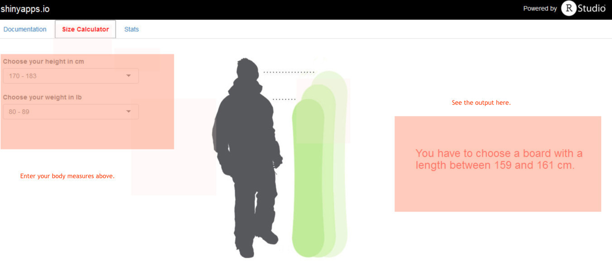

## Summary

Choosing a snowbboard size, especially for beginners is always an open question.

So, how do you pick the correct snowboard length? 

Traditional snowboard sizing meant you stand next to the snowboard and if the top hits your chin, great, it fits! 

While that may be a good place to start, weight is also very important factor in determining the appropriate board length.  

The simple application hosted on https://vnkt.shinyapps.io/ddpr/
privides a simple calculator for establishing the most appropriate snowboard size for you. 

--- 

## How does it work?

The calculator is very simple.

Just enter your height and weight on the left. 

The personalized recommended size will update automatically on the right.

    

---

## Slide 4

Note the recommended size is just a starting point.

Other factors may impact the most appropriate size for you, most notably :
- Ability Level
- Riding Style 
- Favorite Terrain

---

## Slide 5

The apllication contains also a tab with an interactive chart displaying statistics about :

- Snow Sports Participants By Type

- USA Snow Sport Visits By Region (In Millions)

Source of the data:
http://www.snowsports.org/Retailers/Research/SnowSportsFactSheet

